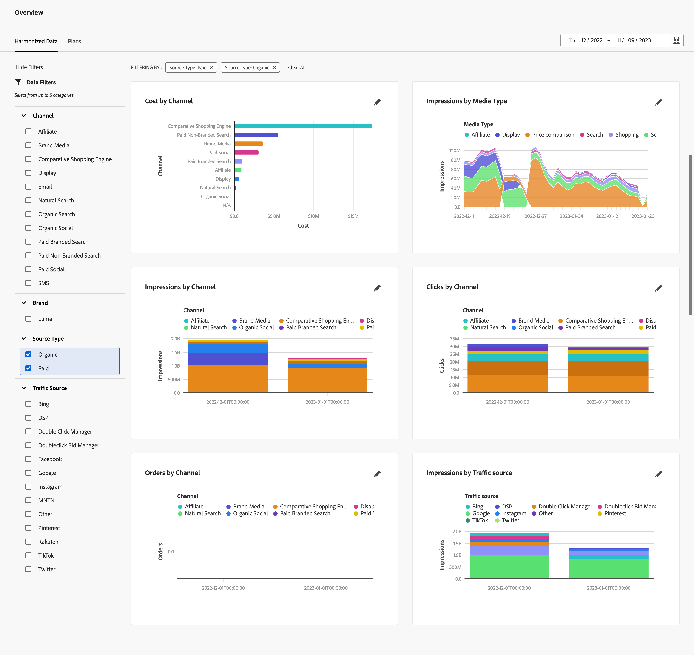

# Harmonized data overview

The Harmonized Data tab in Mix Modeler Overview provides insights into the harmonized data you have configured to be used as part of the ingested data and harmonized data setup.

The overview shows four KPI status card widgets (top row) and six other configurable widgets.

To change the date period for data to be displayed in the widgets, enter a start date, and end date manually or select a period using .

## Data filters 

You can filter the data displayed for all widgets using the  **[!UICONTROL Data Filters]** pane. 

Select one or more filters for each category (**[!UICONTROL Channel]**, **[!UICONTROL Brand]**, **[!UICONTROL Source Type]**, and **[!UICONTROL Traffic Source]**). 

   Selected filters are displayed on top of the widgets at **[!UICONTROL FILTERING BY:]**. 

   1. To remove an individual filter, select  on the filter, listed at **[!UICONTROL FILTERING BY:]**.

   1. You can quickly clear all filters using **[!UICONTROL Clear All]**.

   

## Configure a widget

You can configure each widget. 

* On the KPI status card widget:

  1. Select  and  **[!UICONTROL Edit Data]** from the context menu. 
     
  1. In the **[!UICONTROL KPI status card]** dialog:
     
      1. Select a **[!UICONTROL KPI]** from the list.

      1. Select **[!UICONTROL Apply]** to apply the change to the card. Select **[!UICONTROL Cancel]** to cancel the change.
   
* On the other configurable widgets:

  1. Select  and  **[!UICONTROL Edit Data]** from the context menu. 

  1. In the **[!UICONTROL Edit Data]** dialog:

     1. Select a metric from **[!UICONTROL Select a metric]**, for example **[!UICONTROL Impressions]**.
     1. Select a category from **[!UICONTROL Select category]**, for example **[!UICONTROL Media Type]**.
     1. (optional) select a second category from **[!UICONTROL Select second category (optional)]**, for example **[!UICONTROL Traffic Source]**.
     1. Select  **[!UICONTROL Time]** or  **[!UICONTROL Total]** as the analysis type at **[!UICONTROL Select analysis type]**.

        If you select  **[!UICONTROL Time]**, you can specify the time frequency. Select **[!UICONTROL Daily]**, **[!UICONTROL Weekly]**, **[!UICONTROL Monthly]** or **[!UICONTROL Quarterly]** from **[!UICONTROL Select time frequency]**.

        You see an updated preview of your current selection in the [!UICONTROL Preview Area] and your current widget underneath [!UICONTROL Current].

        

        If the preview cannot be rendered due to data not being available, you see  [!UICONTROL Insights Not Available] - [!UICONTROL Harmonized fields are not available].

     1. Select **[!UICONTROL Apply]** to apply the changes to the widget. Select **[!UICONTROL Cancel]** to cancel any changes made to the current widget.

