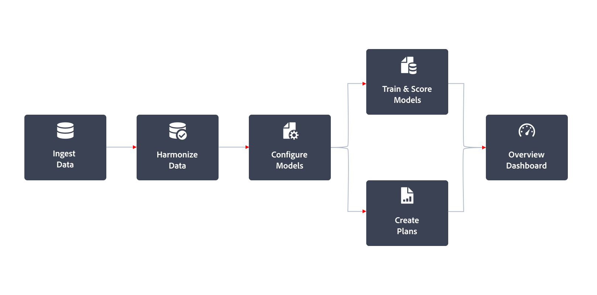

# Mix Modeler workflow

A typical workflow in Mix Modeler looks like:

|  | Activity | Description |
|---|---|---|
| {width="100"} | [**Ingest data**](../ingest-data/overview.md) | Ingest event data from Experience Platform (for example Adobe Analytics, Web SDK, other sources), aggregated data from marketing channels (for example TV, walled gardens, email, owned and operated activities), external factors data from customers (for example price changes in subscription service) and internal factors data (for example holiday plans). |
| {width="100"} | [**Harmonize data**](../harmonize-data/overview.md) | Configure mapping rules and conflict resolution rules to merge the various marketing datasets needed to measure and plan campaign performance in Mix Modeler. |
|  {width="100"} | [**Configure models**](../models/create.md) | Configure model instances with marketing touchpoints (for example channels) and conversion definitions. |
| {width="100"}  | [**Train and score models**](../models/overview.md) | Create aggregate and event-level scores using machine-learning training and scoring.  |
| {width="100"} | [**Create plans**](../plans/overview.md) |  Determine the best allocation of marketing funds to achieve a business objective by using the output of Mix Modeler's models.   |
| {width="100"} | [**Overview dashboard**](../dashboard/overview.md) | Get insights on harmonized data, models, and plans, using various configurable widgets. |

{style="table-layout:auto"}

