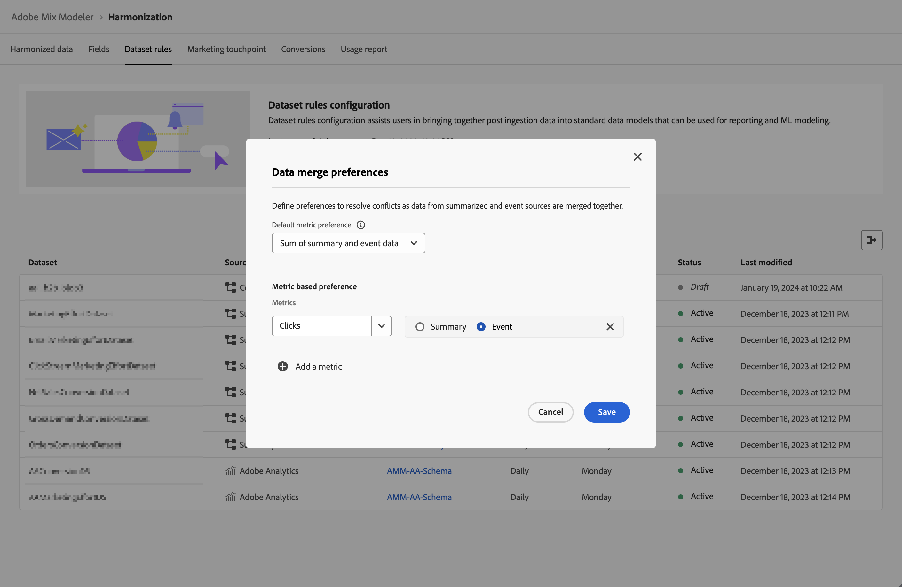

# Dataset rules

Dataset rules assist you in mapping your harmonized fields with fields from the data you ingested in Mix Modeler.

* For aggregate data that you ingested in Adobe Experience Platform, you map one or more of the available dataset fields to the appropriate harmonized fields. 
* For event data, you can individually map one or more harmonized fields to fields from the dataset, directly or using conditions.

## Manage dataset rules

To see a table of the available dataset rules, in the Mix Modeler interface:

1. Select  **[!UICONTROL Harmonized data]** from the left rail.
   
1. Select **[!UICONTROL Dataset rules]** from the top bar. You see a table of the dataset rules.

The table columns specify details about the dataset rules:

| Column name            | Details   |
| ---------------------- | ----------|
| Dataset                | The name of the dataset.  |
| Source                 | The source of the dataset, which can be Adobe Analytics, Experience Events, Summary (aggregate), or Consumer Experience Events.   |
| Schema                 | The schema to which the dataset conforms. You can quickly select the schema name to open the schema in a new tab in the schema editor in Mix Modeler - Schemas.  |
| Granularity            | The granularity of data in the dataset. Possible values are Daily, Weekly, Monthly or Yearly. |
| Start of the week      | Specifies which day of the week is considered the start of a new week for the specific dataset.  |
| Status | The status of the field: 
● Draft or 
● Active |
| Last modified          | Data and time of the last modification of the dataset rule. |

{style="table-layout:auto"}

### Create a dataset rule

To create a dataset rule, in the  **[!UICONTROL Harmonized data]** > **[!UICONTROL Dataset rules]** interface in Mix Modeler, select **[!UICONTROL Create Dataset rule]** in the **[!UICONTROL Dataset rules configuration]** wizard.

In the **[!UICONTROL Create]** screen, 
 
1. In **[!UICONTROL Dataset details]**, select a dataset from **[!UICONTROL Select dataset]** to begin configuration. In the list, datasets are categorized in **[!UICONTROL Consumer Experience Events]**, **[!UICONTROL Adobe Analytics]**, **[!UICONTROL Experience Event]** and **[!UICONTROL Summary]**.

1. Select a day for the **[!UICONTROL Start of the week]**.

1. Select **[!UICONTROL Daily]**, **[!UICONTROL Weekly]**, **[!UICONTROL Monthly]** or **[!UICONTROL Yearly]** for **[!UICONTROL Granularity]**.

1. When you have selected a dataset of **[!UICONTROL Summary]** category:

   1. To define whether data for the dataset needs to be aggregated or is replacing existing data, select **[!UICONTROL Aggregation]** or **[!UICONTROL Replacement]** for **[!UICONTROL Data restatement is by]**. 
   
   1. Map each of the **[!UICONTROL Available dataset fields]** to corresponding **[!UICONTROL Standard harmonized fields]** in **[!UICONTROL Map to harmonized fields]**. If you do not want to map a dataset field to a harmonized field, explicitly select **[!UICONTROL -- None --]**.

   1. If you need a new harmonized field, not available from the list, select **[!UICONTROL Create New]** to create a new harmonized field. You see the dialog as outlined in [Add a new harmonized field](fields.md#add-a-harmonized-field) to quickly allow you to add a new harmonized field.

   1. When the mapping is completed for all fields for the rule, select **[!UICONTROL Save as draft]** to save a draft version of the rule or **[!UICONTROL Save]** to save and activate the rule.  Select **[!UICONTROL Cancel]** to cancel the rule configuration.

      
  
1. When you have selected an event category dataset (**[!UICONTROL Experience Events]**, **[!UICONTROL Adobe Analytics]**, **[!UICONTROL Consumer Experience Events]**), in the box underneath **[!UICONTROL Map to harmonized fields]**:

   1. Select a harmonized field from **[!UICONTROL Standard harmonized field]**.

   1. When the selected harmonized field is of type metric:

      1. Select **[!UICONTROL Count]** or **[!UICONTROL Sum]** from **[!UICONTROL Mapping type]**.

      1. Select an **[!UICONTROL *AEP dataset field*]** that you want the harmonized field to map to by default.

   1. When the selected field is of type dimension:

      1. Select **[!UICONTROL Map Into]** or **[!UICONTROL Case]** from **[!UICONTROL Mapping type]**.

      1. When you have selected **[!UICONTROL Map Into]**, select **[!UICONTROL Field]** and **[!UICONTROL *AEP dataset field*]** or **[!UICONTROL Value]**  and a default value to map the harmonized field by default to the dataset field or entered value.

      1. When you have select **[!UICONTROL Case]**, select **[!UICONTROL Field]** and **[!UICONTROL *AEP dataset field*]** or **[!UICONTROL Value]**  and a default value to map the harmonized field by default to the dataset field or entered value. 

         1. Also, you define one or more cases, consisting of one or more conditions to explicitly set values. Each condition can check for a specific **[!UICONTROL *AEP dataset field*]** whether it **[!UICONTROL Exists]** or **[!UICONTROL Not Exists]** or whether it **[!UICONTROL Contains]**, **[!UICONTROL Not Contains]**, **[!UICONTROL Equals]**, **[!UICONTROL Not Equals]**, **[!UICONTROL Starts With]**, or **[!UICONTROL Ends With]** a value entered at **[!UICONTROL *Enter input value*]**.

         1. To add another case, select  **[!UICONTROL Add case]**, to add another condition, select  **[!UICONTROL Add condition]**.

         1. To delete a case or condition, select  in the corresponding container.

         1. To select whether any or all of the conditions should apply for a case, select **[!UICONTROL Any of]** or **[!UICONTROL All of]**.

         1. To set the outcome value for a case, enter the value at **[!UICONTROL Then]**.

      The example below 

      * uses a **[!UICONTROL Map Into]** **[!UICONTROL Mapping type]** to map the **[!UICONTROL Channel Type At Source]** harmonized field to the **[!UICONTROL channel_type]** field from the **[!DNL Luma Transactions]** dataset.
  
      * uses a **[!UICONTROL Case]** **[!UICONTROL Mapping type]** to conditionally map the value of the **[!UICONTROL marketing.campaignName]** field in the **[!DNL Luma Transactions]** dataset to the **[!UICONTROL Campaign]** harmonized field. The Campaign harmonized field is set to:
         
        * `Black Friday` when the **[!UICONTROL marketing.campaignName]** is `_black_friday` or `BlackFriday`. 
        * to the value of the **[!UICONTROL marketing.campaignName]** in all other cases.

         

1. Select  **[!UICONTROL Add field]** to define additional fields.

When finished,select **[!UICONTROL Save as draft]** to save a draft version of the rule or **[!UICONTROL Save]** to save and activate the rule.  Select **[!UICONTROL Cancel]** to cancel the rule configuration.

### Edit a dataset rule

To edit a dataset rule, in the  **[!UICONTROL Harmonized data]** > **[!UICONTROL Dataset rules]** interface in Mix Modeler:

1. Select  in the **[!UICONTROL Dataset]** column for the dataset rule that you want to edit.
1. From the context menu, select  **[!UICONTROL Edit]** to start editing the dataset rule. Refer to [Create a dataset rule](#create-a-dataset-rule) for more details.

### Delete a dataset rule

To delete a dataset rule, in the  **[!UICONTROL Harmonized data]** > **[!UICONTROL Dataset rules]** interface in Mix Modeler:

1. Select  in the **[!UICONTROL Dataset]** column for the dataset rule that you want to delete.
1. From the context menu, select  **[!UICONTROL Delete]** to delete the dataset rule. You will be prompted for confirmation. Select **[!UICONTROL Delete]** to permanently delete the selected dataset rule..
   

## Sync data

To sync data between your harmonized data and summary and / or event datasets, following all of the logic in your dataset rules: 

1. Select **[!UICONTROL Sync data]**.

1. From the **[!UICONTROL Sync data for dataset rules]** dialog, select either **[!UICONTROL Refresh harmonized data for summary datasets]**, **[!UICONTROL Refresh harmonized data for event datasets]**, or **[!UICONTROL Refresh harmonized data for both summary + event datasets]**.
   
1. Select **[!UICONTROL Sync]** to start the synchronization based on the defined dataset rules between harmonized data and data in datasets. To cancel the synchronization, select **[!UICONTROL Cancel]**.

   

## Data merge preferences

You can define preferences to resolve conflicts as data from summarized and event sources are merged together. To do this:

1. Select  **Data merge preferences**.

1. In the **[!UICONTROL Data merge preferences]** dialog:

   

   1. Select a default metric preference from the **[!UICONTROL Default metric preference]** list. 
A default preference is applied when during harmonization, multiple sources of data try to update a metric field for a given channel. This preference is applied at the sandbox level unless overridden for certain metric preferences defined at **[!UICONTROL Metric based preference]**.

   1. Use  **[!UICONTROL Add a metric]**, to add one or more metrics below **[!UICONTROL Metric based preference]**.

      * Select a metric from the **[!UICONTROL _Metric selection_]** list, and
      * Select **[!UICONTROL Summary]** or **[!UICONTROL Event]**.

      Use  to delete an entry from the list.

   1. Select **[!UICONTROL Save]** to save the data merge preferences. Select **[!UICONTROL Cancel]** to cancel.
