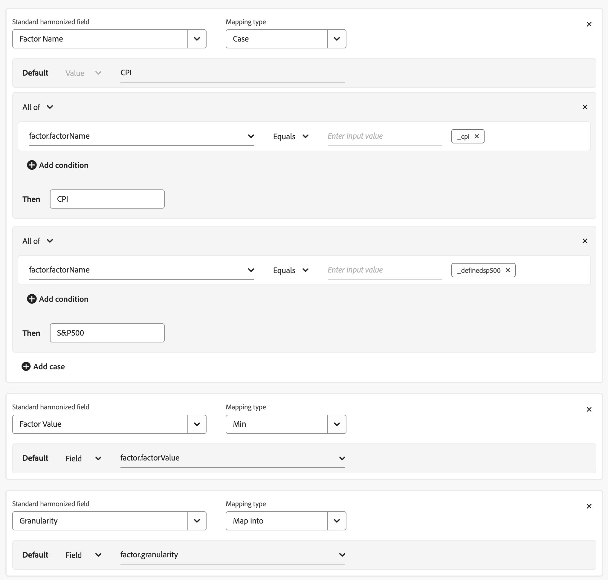

# Dataset rules

Dataset rules assist you in mapping your harmonized fields with fields from the data you ingested in Mix Modeler.

* For aggregate data that you ingested in Adobe Experience Platform, you map one or more of the available dataset fields to the appropriate harmonized fields. 
* For event data, you can individually map one or more harmonized fields to fields from the dataset, directly or using conditions.

## Manage dataset rules

To see a table of the available dataset rules, in the Mix Modeler interface:

1. Select  **[!UICONTROL Harmonized data]** from the left rail.
   
1. Select **[!UICONTROL Dataset rules]** from the top bar. You see a table of the dataset rules.

You can search for a dataset quickly using  **[!UICONTROL _Enter a dataset name_]**.

The table columns specify details about the dataset rules:

| Column name            | Details   |
| ---------------------- | ----------|
| **[!UICONTROL Dataset]**                | The name of the dataset.  Use  to select actions for a dataset. You can:<ul><li> **[!UICONTROL View]** to view the dataset rules configuration. All fields are disabled.</li><li> **[!UICONTROL Edit]** to edit the dataset rules configuration.</li><li> **[!UICONTROL Delete]** to delete the dataset rules configuration. You are prompted to confirm the deletion in the Delete Dataset dialog. Select **[!UICONTROL Delete]** to delete the dataset rule configuration permanently.</li><ul> |
| **[!UICONTROL Source]**                 | The source of the dataset: Adobe Analytics, Experience Events, Summary (aggregate), or Consumer Experience Events.   |
| **[!UICONTROL Schema]**                 | The schema to which the dataset conforms. You can quickly select the schema name to open the schema in a new tab in the schema editor in  [Schemas](../ingest-data/schemas.md).  |
| **[!UICONTROL Granularity]**            | The granularity of data in the dataset. Possible values are Daily, Weekly, Monthly or Yearly. |
| **[!UICONTROL Start of the week]**      | Specifies which day of the week is considered the start of a new week for the specific dataset.  |
| **[!UICONTROL Status]** | The status of the field:  Draft or  Active |
| **[!UICONTROL Last modified]**          | Data and time of the last modification of the dataset rule. |

{style="table-layout:auto"}

### Create a dataset rule

To create a dataset rule, in the  **[!UICONTROL Harmonized data]** > **[!UICONTROL Dataset rules]** interface in Mix Modeler, select **[!UICONTROL Create a dataset rule]** in the **[!UICONTROL Dataset rules configuration]** wizard.

In the **[!UICONTROL Create]** screen, 
 
1. In **[!UICONTROL Dataset details]**, select a dataset from **[!UICONTROL Select dataset]** to begin configuration. In the list, datasets are categorized in **[!UICONTROL Summary]**, **[!UICONTROL Adobe Analytics]**, **[!UICONTROL Experience Event]**, **[!UICONTROL Factors]**, and **[!UICONTROL Consumer Experience Events]**.

1. Select a day for the **[!UICONTROL Start of the week]**.

1. Select **[!UICONTROL Daily]**, **[!UICONTROL Weekly]**, **[!UICONTROL Monthly]** or **[!UICONTROL Yearly]** for **[!UICONTROL Granularity]**.
   
1. When you have selected a dataset of the **[!UICONTROL Summary]** or **[!UICONTROL Factors]** category, select **[!UICONTROL Aggregation]** or **[!UICONTROL Replacement]** for **[!UICONTROL Data restatement is by]**. 

   Reporting data from publishers is very important to marketing analysts since working with publishers often implies significant spend, and changes in the reporting data may result in very different insights and investment plans. Furthermore, marketing analysts need accurate data to derive the right insights and present convincing proposals to gain stakeholder confidence. However, these publishers, such as Google and Facebook, often restate or delete reporting data as they reconcile their data. The time frame for most of the changes is within 7 days of the reported media performance. Additional changes in the data are possible within 30 days. In general, after 30 days, books are considered closed and data complete. 

   Mix Modeler supports data restatement. To ensure that the data that is used for reporting, modeling, and planning is accurate. And that the data is able to support the brand and marketing analyst's expectations and needs.
   
   You can send restated rows of summary data as incremental rows in an Experience Platform dataset and the harmonization service updates the harmonized dataset with that restated data. Similarly, you can also remove rows of summary data that needs to be reflected in the harmonization service. 

1. In the **[!UICONTROL Map to harmonized fields]** section, select a harmonized field from **[!UICONTROL Standard harmonized field]**. To [create a new harmonized field](/help/harmonize-data/fields.md#add-a-harmonized-field) quickly, select **[!UICONTROL Create new]**.

   * When the selected harmonized field is of type metric:

      1. Select **[!UICONTROL Count]** or **[!UICONTROL Sum]** from **[!UICONTROL Mapping type]**.

      1. Select an **[!UICONTROL *AEP dataset field*]** that you want the harmonized field to map to by default.

   * When the selected field is of type dimension:

      1. Select **[!UICONTROL Map Into]** or **[!UICONTROL Case]** from **[!UICONTROL Mapping type]**.

      1. When you have selected **[!UICONTROL Map Into]**, select **[!UICONTROL Field]** and **[!UICONTROL *AEP dataset field*]** or **[!UICONTROL Value]** and a default value to map the harmonized field by default to the dataset field or entered value.

      1. When you select **[!UICONTROL Case]**, select **[!UICONTROL Field]** and **[!UICONTROL *AEP dataset field*]** or **[!UICONTROL Value]** and a default value to map the harmonized field by default to the dataset field or entered value. 

         1. To set values explicitly, you define one or more cases, consisting of one or more conditions. Each condition can check for a specific **[!UICONTROL *AEP dataset field*]** whether it **[!UICONTROL Exists]** or **[!UICONTROL Not Exists]** or whether it **[!UICONTROL Contains]**, **[!UICONTROL Not Contains]**, **[!UICONTROL Equals]**, **[!UICONTROL Not Equals]**, **[!UICONTROL Starts With]**, or **[!UICONTROL Ends With]** a value entered at **[!UICONTROL *Enter input value*]**.

         1. To add another case, select  **[!UICONTROL Add case]**, to add another condition, select  **[!UICONTROL Add condition]**.

         1. To delete a case or condition, select  in the corresponding container.

         1. To select whether any or all the conditions should apply for a case, select **[!UICONTROL Any of]** or **[!UICONTROL All of]**.

         1. To set the outcome value for a case, enter the value at **[!UICONTROL Then]**.

      The example below:

      * uses a **[!UICONTROL Map Into]** **[!UICONTROL Mapping type]** to map the **[!UICONTROL Channel Type At Source]** harmonized field to the **[!UICONTROL channel_type]** field from the **[!DNL Luma Transactions]** dataset.
  
      * uses a **[!UICONTROL Case]** **[!UICONTROL Mapping type]** to map conditionally the value of the **[!UICONTROL marketing.campaignName]** field in the **[!DNL Luma Transactions]** dataset to the **[!UICONTROL Campaign]** harmonized field. The Campaign harmonized field is set to:
         
        * `Black Friday` when the **[!UICONTROL marketing.campaignName]** is `_black_friday` or `BlackFriday`. 
        * to the value of the **[!UICONTROL marketing.campaignName]** in all other cases.

         

1. Select  **[!UICONTROL Add field]** to define additional fields.

When finished, select **[!UICONTROL Save as draft]** to save a draft version of the rule or **[!UICONTROL Save]** to save and activate the rule. Select **[!UICONTROL Cancel]** to cancel the rule configuration.

>[!NOTE]
>
>The dedicated **[!UICONTROL Map to harmonized fields]** experience for summary datasets rules is deprecated. All dataset rules now use similar **[!UICONTROL Map to harmonized fields]** experience, irrespective of dataset type. For summary datasets for which you have defined rules using the deprecated **[!UICONTROL Map to harmonized fields]** experience, you might want to verify these rules against the generic **[!UICONTROL Map to harmonized field]** experience.
>

#### Summary datasets

When you map a standard harmonized field from a summary dataset, Mix Modeler tries to deduce the corresponding Experience Platform dataset field. When successful:

* If the field is of type dimension, **[!UICONTROL Map into]** is selected as **[!UICONTROL Mapping type]**.
* If the field is of type metric, **[!UICONTROL Sum]** is selected as **[!UICONTROL Mapping type]**.
* **[!UICONTROL Field]** is selected as the **[!UICONTROL Default]** mapping type.
* The corresponding Experience Platform dataset field is inserted automatically for *AEP Dataset Field*.

You can change any of the proposed values if these are incorrect or not supporting your specific use case.

#### Factor datasets

You map harmonized fields to fields in a factor dataset, so you can [add factors as part of your model configuration](/help/models/build.md).

When you map harmonized fields to fields in a factor datasets, the following applies:

##### Factor name

When you map a standard harmonized factor field from a factor dataset and the factor dataset contains a single factor, use **[!UICONTROL Map into]** as the **[!UICONTROL Mapping type]** and enter a default value for the **[!UICONTROL Factor Name]** harmonized field. 
     

If the the factor dataset contains multiple factors, use the **[!UICONTROL Case As]** as the **[!UICONTROL Mapping Type]** to define a mapping between the Factor Name harmonized field and each distinct factor name.

##### Factor type

This field is optional in the factor dataset and schema. If **[!UICONTROL Factor type]** is defined in the factor dataset and schema and specifies either **[!UICONTROL Internal]** or **[!UICONTROL External]**, the provided value is used. If no value is specified, the default **[!UICONTROL Internal]** is used.

##### Value type

This field is optional in the factor dataset and schema. If **[!UICONTROL Value type]** is defined in the factor dataset and schema and specifies either **[!UICONTROL Actual]** or **[!UICONTROL Forecasted]**, the provided value is used. If no value is specified, the default **[!UICONTROL Actual]** is used.

##### Granularity

You can define a dataset rule for the granularity of a factor dataset when all factors within the factor dataset have the same source granularity. 

As soon as factor datasets are harmonized, all datasets conform to the highest level of granularity across the harmonized dataset.

##### Factor value

For the **[!UICONTROL Factor value]** harmonized field use one of the aggregation operators as the **[!UICONTROL Mapping Type]**. When multiple factors are defined in a factor dataset, the aggregate operator is applied to all factors.

##### Example

* You have a factor dataset, with the following sample data:

  | Timestamp | Factor Name | Factor Value |
  |---|---|---:|
  | 13 Mar 2025 | _definedsp500 | 10 |
  | 13 Mar 2025 | _cpi | 20 |
  | 14 Mar 2025 | _definedsp500 | 30 |
  | 14 Mar 2025 | _cpi | 40 |
  | 15 Mar 2025 | _definedsp500 | 50 |
  | 15 Mar 2025 | _cpi | 60 |

* And you define the following dataset rules for **[!UICONTROL Factor Name]**, **[!UICONTROL Factor Value]** and **[!UICONTROL Granularity]**:

   

* Then this will result in the following harmonized data:

  | Factor Name | Factor Value | Factor Type | Value Type |
  |---|---:|---|---|
  | CPI | 20 | Internal | Actual |
  | S&P 500 | 10 | Internal | Actual |

  Since there are no dataset rules defined for **[!UICONTROL Factor Type]** and **[!UICONTROL Value Type]**, the defaults are used.

### Edit a dataset rule

To edit a dataset rule, in the  **[!UICONTROL Harmonized data]** > **[!UICONTROL Dataset rules]** interface in Mix Modeler:

1. Select  in the **[!UICONTROL Dataset]** column for the dataset rule that you want to edit.
1. From the context menu, select  **[!UICONTROL Edit]** to start editing the dataset rule. Refer to [Create a dataset rule](#create-a-dataset-rule) for more details.

### Delete a dataset rule

To delete a dataset rule, in the  **[!UICONTROL Harmonized data]** > **[!UICONTROL Dataset rules]** interface in Mix Modeler:

1. Select  in the **[!UICONTROL Dataset]** column for the dataset rule that you want to delete.
1. From the context menu, select  **[!UICONTROL Delete]** to delete the dataset rule. You are prompted for confirmation. Select **[!UICONTROL Delete]** to delete the selected dataset rule permanently.

## Sync data

To sync data between your harmonized data and summary and / or event datasets while applying the logic in your dataset rules: 

1. Select **[!UICONTROL Sync data]**.

1. From the **[!UICONTROL Sync data for dataset rules]** dialog, either select
   * **[!UICONTROL Refresh harmonized data for summary datasets]**, 
   * **[!UICONTROL Refresh harmonized data for event datasets]**, or 
   * **[!UICONTROL Refresh harmonized data for both summary + event datasets]**.
   
1. To start the synchronization based on the defined dataset rules between harmonized data and data in datasets, select **[!UICONTROL Sync]**. To cancel the synchronization, select **[!UICONTROL Cancel]**.

   

## Data merge preferences {#data-merge-preferences}

>[!CONTEXTUALHELP]
>id="harmonizeddata_datasetrules_datamergepreferences"
>title="Default metric preference"
>abstract="Default preference is applied when during harmonization, multiple sources of data try to update a metric field for a given channel. This preference is applied at the sandbox level unless overridden for certain metric preferences if defined below."

>[!NOTE]
>
>[!BADGE beta]{type=Informative} The Data merge preferences is a beta feature and its functionality is subject to change.

To ensure accurate model predictions, you can define data merge preferences. This functionality enables users to resolve any conflicts post merging of summary level and event level data.

You can configure a default metric preference to be applied in cases of conflicting updates. This default metric can be one of three options:

* **[!UICONTROL Summary data]** 
* **[!UICONTROL Sum of summary and event data]** 
* **[!UICONTROL Event data]** 
  
When, during harmonization, multiple sources of data try to update a metric field for a given channel, the default preference configured by the user is applied. This preference is applied at the sandbox level unless overridden for certain metric based preferences configured additionally. 

Under **[!UICONTROL Metric based preferences]**, user can configure the specific source (**[!UICONTROL Summary]** or **[!UICONTROL Event]**) for a given metric and the corresponding conversion type for that metric. 

Typical use cases are:

* the same advertising metric is measured and reported in multiple datasets, or
* metrics measurement may be incomplete in some datasets, while another dataset may be a superset of a particular metric, resulting to double counting. 

### Configure

To configure data merge preferences:

1. Select  [!BADGE beta].

1. In the **[!UICONTROL Data merge preferences]** [!BADGE beta]{type=Informative} dialog:

   

   * Select a **[!UICONTROL Default metric preference]**. The selected default metric preference is applied when, during harmonization, multiple sources of data update a metric field for a given channel. The preference is applied at the sandbox level, unless overridden for specific metric based preferences. You can select between **[!UICONTROL Summary data]**, **[!UICONTROL Event data]** and **[!UICONTROL Sum of summary and event data]**.

   * To add specific metric based preferences:
   
      1. Select  **[!UICONTROL Add a metric]**.
         1. Select a metric from the **[!UICONTROL *Metric selection*]** list.
         1. Select **[!UICONTROL CHANNELS]** or **[!UICONTROL CONVERSION TYPES]**. From the list, select **[!UICONTROL All]** or a specific channel or conversion type.
         1. Select **[!UICONTROL Summary]** or **[!UICONTROL Event]** to specify whether summary data or event data is preferred for the metric (and all or selected channel) when merging data.
   
         To add one or more additional channel or conversion types:
         
         1. Select  **[!UICONTROL Add a channel]** or  **[!UICONTROL Add a conversion type]**.
         1. Select **[!UICONTROL Summary]** or **[!UICONTROL Event]**.

         To delete a channel or conversion type, select .

      1. To add more specific metric based preferences, repeat the previous step.

   * To delete an existing specific metric based preference, select .

1. Select **[!UICONTROL Save]** to save the data merge preferences. A re-sync of the data is initiated.  Select **[!UICONTROL Cancel]** to cancel.

## Delete a source dataset

When you delete a source dataset that is used in your harmonized data, the underlying entries on that source dataset are removed from the [[!UICONTROL Harmonized data]](/help/harmonize-data/overview.md). However, the dataset rule with the deleted source dataset remains in the dataset rule config list with an icon  indicating that the source dataset has been deleted. To get more details:

* Select  and  **[!UICONTROL View]** from the context menu. 
  The **[!UICONTROL Dataset rule mapping - Fields]** dialog displays information about the deleted source dataset and the fields used in the dataset rule configuration.

When you return to your **[!UICONTROL Dataset rules]** configuration, you see a dialog explaining that one or more of the source datasets have been deleted. The harmonized data is impacted on a next ad-hoc or scheduled sync. Review your dataset rule configuration.

The harmonized data is updated without the deleted source data upon the next ad-hoc sync or scheduled sync. However, you continue to see alert dialogs prompting you to delete the dataset rule based on the deleted source dataset. This alert allows users to view and evaluate the impacted fields in the deleted dataset. And to determine the impact to marketing touchpoints or conversions that may be used in any models. Once you have reviewed and mitigated for this impact, you should delete the dataset rule from the dataset rule config list.
