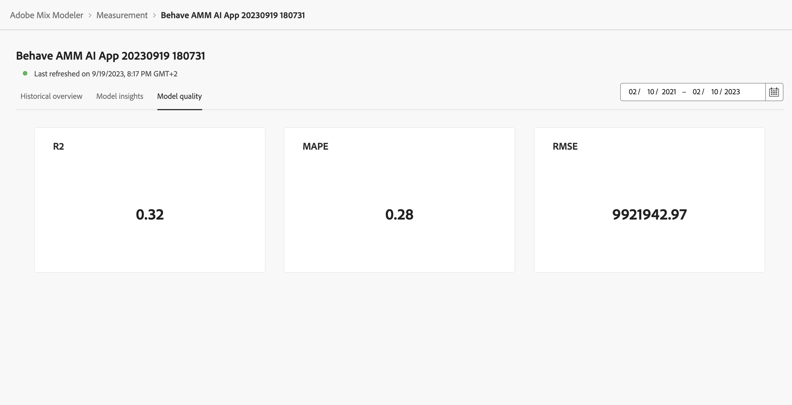

# Model Insights

To view model insights, in the  **[!UICONTROL Models]** interface in Mix Modeler:

1. Select the name of a model with a **[!UICONTROL Last run status]** of ● **[!UICONTROL Success]** from the **[!UICONTROL Models]** table.
   
1. From the context menu, select **[!UICONTROL Model Insights]**.

You see when the specified model is last refreshed and widgets are displayed using three tabs: Historical overview, Model insights, and Model quality.

You can change the date period on which the widgets on each of the tabs are based on. Enter a date period or select  to select a date period.

## Historical overview

The Historical overview tab shows widgets for:

* Conversion and Spend by Fiscal Qtr and Product.
  
* Spend by Channel.

* Touchpoint Spend.

  You can select an alternative spend-based channel to display for this widget. Select a channel from **[!UICONTROL Channels]**.

* Touchpoint Volume.

    You can select an alternative volume-based channel to display for this widget. Select a channel from **[!UICONTROL Channels]**.

## Model insights

The Model insights tab shows widgets for:

* Contribution by date and base media. The stacked graph is ordered: Base at the bottom, Non spend channels in the middle, and Spend channels on top.

* Contribution by channel.

* Marketing performance summary.

* Marginal response curves.

You can hover over individual chart elements in each widget to display a popover with more details.

To download a CSV file containing the data for the widget, select .

To download full model insights data in Microsoft&reg; Excel format, select  **[!UICONTROL Download data]**. 

## Model quality

<!--
The Model quality tab shows widgets for measuring:

* R2 (R-squared), which tells how well the data fits the regression model (the goodness of fit).

* MAPE (Mean Absolute Percentage Error), which is one of the most commonly used KPIs to measure forecast accuracy and expresses the forecast error as a percentage of the actual value.

* RMSE (Root Mean Square Error): which shows the average "error", weighted according to the square of the error.

To download a CSV file containing the data for the widget, select  in the widget and from the context menu select  **[!UICONTROL Download as CSV]**.

-->

The model quality tabs shows a 

  * [!UICONTROL Model Assessment] visualization, which you can breakdown on Actual vs. Predicted or Residual conversions.

     To breakdown the visualization, select **[!UICONTROL Actual vs. Predicted]** or **[!UICONTROL Residuals]** from the **[!UICONTROL Breakdown]** list.

  * [!UICONTROL Model fitting metrics] table, showing the following colunmns for each conversion metrics:
  
    * Actual Conversion
    
    * Modeled Conversion
    
    * Residual Conversion (difference between actual and modeled conversion)
    
    * Model quality score values:

      * R2 (R-squared), which tells how well the data fits the regression model (the goodness of fit).

      * MAPE (Mean Absolute Percentage Error), which is one of the most commonly used KPIs to measure forecast accuracy and expresses the forecast error as a percentage of the actual value.

      * RMSE (Root Mean Square Error): which shows the average "error", weighted according to the square of the error.

    To download a CSV file containing the data for the table, select .
