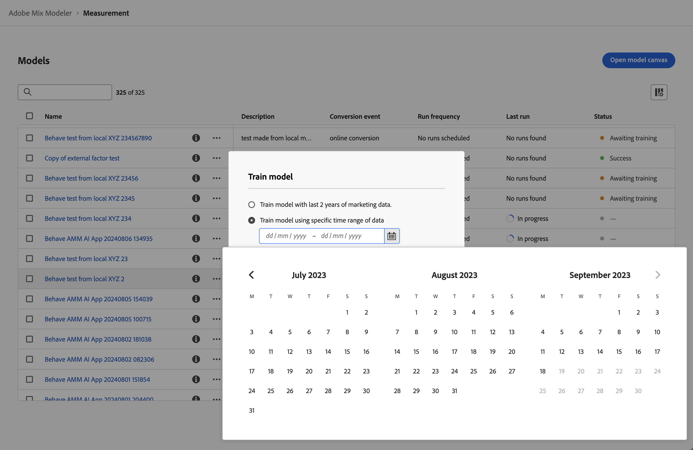

# Train and score models

After you have [built](/help/models/build.md) a model, the model is automatically trained and scored. You can manually retrain or rescore a model.

## Train

Consider to retrain a model when you want to include new incremental marketing and factor data. For example, over the last quarter, market dynamics have changed or your marketing data distribution has changed significantly.

To retrain a model:

   1. Select  **[!UICONTROL Models]** from the left rail.

   1. Select  for a model, and from the context menu select **[!UICONTROL Train]**. Alternatively, select  **[!UICONTROL Train]** from the blue action bar.

      In the **[!UICONTROL Train model]** dialog, select the option to: 

      * **[!UICONTROL Train model with last 2 years of marketing data]**, or 
      * **[!UICONTROL Train model using specific date range of data]**. 
        Specify the date range. You can use the  to select a date range. You have to select a data range with a minimum of one year.

      

   1. Select **[!UICONTROL Train]** to retrain the model.

You can only retrain a model when the model is successfully trained.

## Score

You can incrementally score a model based on new marketing data or rescore a model for a specific date range. 

Consider to rescore a model when you want to:

* Correct incorrect marketing data. For example, the recent paid search data you included in the training and scoring of the model missed a week of data.
* Use new incremental marketing data that has become available through updates in the datasets you have configured as part of your harmonized data.

To score or rescore a model:

   1. Select  **[!UICONTROL Models]** from the left rail.

   1. Select  for a model, and from the context menu select **[!UICONTROL Score]**. Alternatively, select  **[!UICONTROL Score]** from the blue action bar.

      In the **[!UICONTROL Score marketing data]** dialog, select the option to: 

      * **[!UICONTROL Score new marketing data from *mm/dd/yyyy*]**, to score your model incrementally using new marketing data, or 
      * **[!UICONTROL Score specific date range of marketing data]** to rescore for a specific date range. 
        Specify the date range. You can use the  to select a date range. 

      

   1. Select **[!UICONTROL Score]**. When rescoring a model using a specific data range, you see an **[!UICONTROL Existing model is replaced]** dialog, prompting you to confirm to replace the model with new scores for the selected date range. Select **[!UICONTROL Replace model]** to confirm.

>[!IMPORTANT]
>
>Rescore of a model does not change any Plans that are already created based on the rescored model. To use the new rescored model in a plan, you have to create a new plan.
