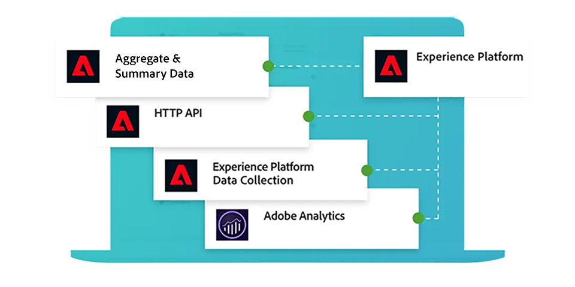
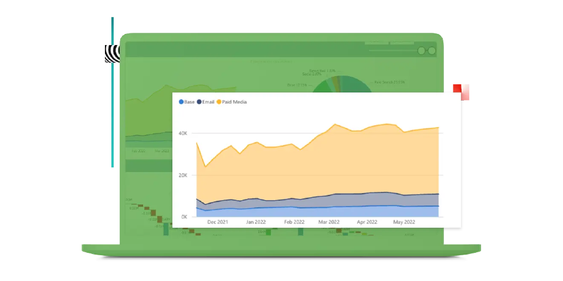
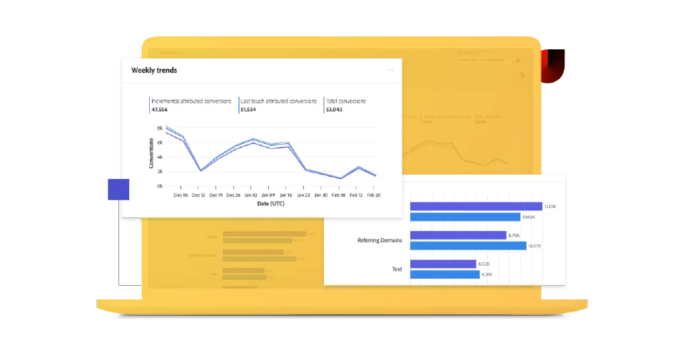

# Adobe Mix Modeler guide

This technical documentation guide provides self help assistance for Adobe **Mix Modeler**. Mix Modeler is an Adobe Experience Cloud application that measures campaigns and optimizes planning holistically across all channels: paid, earned, and owned. Mix Modeler is built on top of Adobe Experience Platform and powered by Adobe Sensei. 

## Start with the basics

<table style="table-layout:fixed">
  <tr style="border: 0;">
    <td>
    
    
<strong>Quick start</strong> Get an overview of and insight into the workflow of Mix Modeler.

    </td>
    <td>
    
    
<strong>Ingest data</strong> Learn how to ingest event and aggregate or summary data into Mix Modeler.

    </td>
    <td>
    
    
<strong>Harmonize data</strong> Learn how to assimilate  aggregate and event data into a consistent data view.. 
    

    </td>
    <td>
    
    
<strong>Model & Plan</strong> Train and score your models and use the insights for your marketing plans.

    </td>
  </tr>
  <tr style="border: 0;">
    <td align="center"></td>
    <td align="center"></td>
    <td align="center"></td>
    <td align="center"></td>
    </tr>
</table>

## Explore the documentation

<table style="table-layout:fixed">
  <tr style="border: 0;">
    <td>
       
      <strong>Ingest data</strong> <a href="/help/ingest-data/overview.md">Overview</a> - <a href="/help/ingest-data/schemas.md">Schemas</a> - <a href="/help/ingest-data/datasets.md">Datasets</a> 
    </td>
    <td>
       
      <strong>Harmonize data</strong> <a href="/help/harmonize-data/overview.md">Overview</a> - <a href="/help/harmonize-data/fields.md">Fields</a>  - <a href="/help/harmonize-data/dataset-rules.md">Dataset rules</a> - <a href="/help/harmonize-data/marketing-touchpoints.md">Marketing touchpoints</a> - <a href="/help/harmonize-data/conversions.md">Conversions</a> - <a href="/help/harmonize-data/usage-report.md">Usage report</a>  
    </td>
    <td>
       
      <strong>Models</strong> <a href="/help/models/overview.md">Overview</a> - <a href="/help/models/build.md">Build models</a> - <a href="/help/models/insights.md">Model insights</a> - <a href="/help/models/scoring-data.md">Use scoring data</a>
    </td>
  </tr>
  <tr style="border: 0;">
    <td>
       
      <strong>Plans</strong> <a href="/help/plans/overview.md">Plans</a> - <a href="/help/plans/build.md">Build plans</a> - <a href="/help/plans/compare.md">Compare plans</a> - <a href="/help/plans/build.md">Plan insights</a>
    </td>
    <td>
       
      <strong>Overview</strong> <a href="/help/dashboard/overview.md">Schemas</a> - <a href="/help/dashboard/harmonized-data.md">Harmonized data</a> - <a href="/help/dashboard/plans.md">Plans</a>
    </td>
        <td>
       
      <strong>Tutorials</strong> <a href="https://experienceleague.adobe.com/docs/mix-modeler-learn/tutorials/overview.html?lang=en">Overview</a> - <a href="https://experienceleague.adobe.com/docs/mix-modeler-learn/tutorials/intro/use-cases.html?lang=en">Use cases</a> - <a href="https://experienceleague.adobe.com/docs/mix-modeler-learn/tutorials/intro/user-workflow.html?lang=en">User workflow</a>  - <a href="https://experienceleague.adobe.com/docs/mix-modeler-learn/tutorials/intro/user-interface-tour.html?lang=en">User interface tour</a>
    </td>
  </tr>
</table> 

