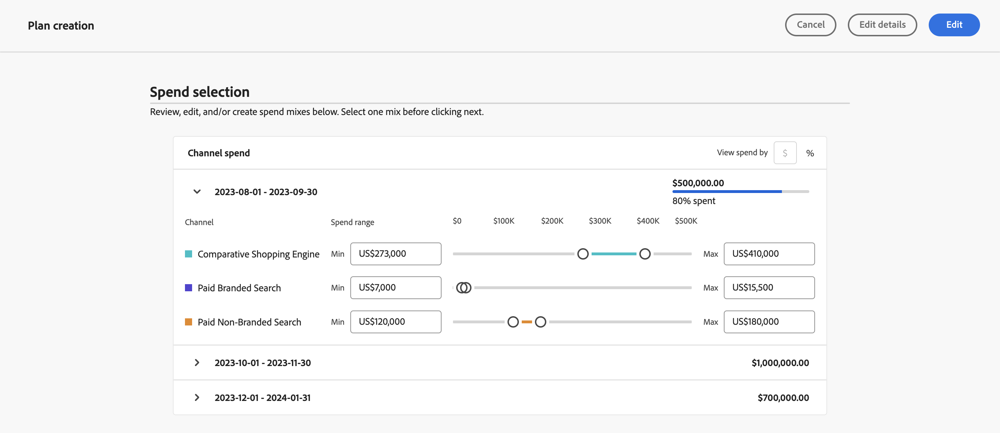
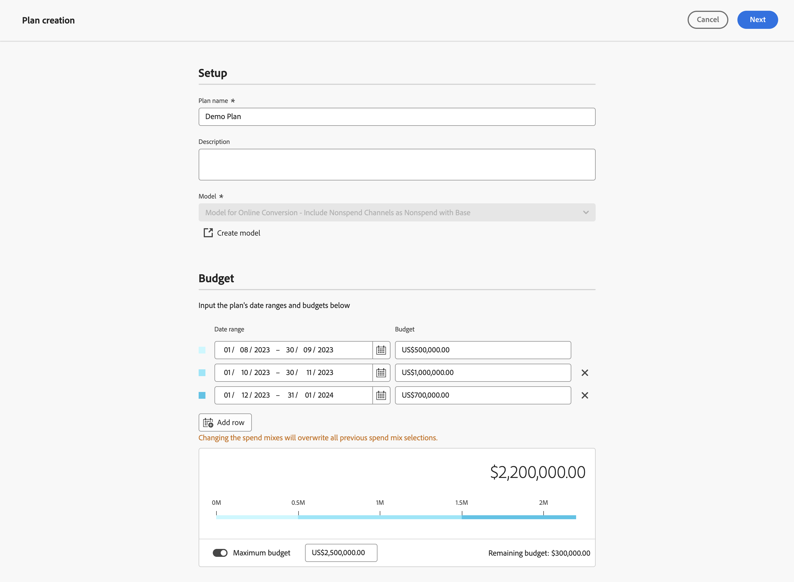

# Edit a plan

To edit a plan, in the  **[!UICONTROL Plans]** interface in Adobe Mix Modeler, select your plan by its name.
   
In [!UICONTROL Plan insights], your plan insights are created, showing the [!UICONTROL Model], the [!UICONTROL Data range], and [!UICONTROL Total budget] on which the plan is based.

When finished retrieving, you see an overview of your plan with visualizations for [!UICONTROL Forecasted ROI] and [!UICONTROL Forecasted revenue].

1. Select **[!UICONTROL Close]** to return to the Plans interface. 

1. (optional) Select **[!UICONTROL Plan breakdown]** to see a breakdown table of your plan.

    

1. To edit your plan, select **[!UICONTROL Edit plan]**:
    
    1. In the **[!UICONTROL Spend selection]** section, for each budget date range, use the  to open the channel distribution view for that data range.

    1. To modify the budgets for each channel, modify the values for **[!UICONTROL Min]** and **[!UICONTROL Max]** or use the sliders.

    1. To toggle between currency or percentage input, select **[!UICONTROL $]** or **[!UICONTROL %]** for **[!UICONTROL View spend by]**.

       

    1. To edit the details of your plan, select **[!UICONTROL Edit details]**:

       1. In the **[!UICONTROL Setup]** section, if applicable, modify the **[!UICONTROL Plan name]** and the **[!UICONTROL Description]**.

       1. In the **[!UICONTROL Budget]** section:

          1. Modify the **[!UICONTROL Date range]** for one or more of your plan's date ranges, either by typing dates or selecting a date range using .

          1. Modify the **[!UICONTROL Budget]** one or more of your plan's date ranges.
     
          To add additional date ranges, each with their budget, select  **[!UICONTROL Add row]**.
     
          To delete a date range and associated budget, select .

          To define a maximum budget:

          1. Switch **[!UICONTROL Maximize budget]** on.
          1. Specify the amount of maximum budget. The amount should be equal or higher than the total amount of budgets specified for the date ranges.

       1. Select **[!UICONTROL Next]** to return to the **[!UICONTROL Spend]** section. Select **[!UICONTROL Cancel]** to return back to your plans overview.

          

1. When finished editing your plan, select **[!UICONTROL Edit]**.

    In the **[!UICONTROL All changes are final]** dialog, select **[!UICONTROL OK]** to update the plan's current spend allocation and ROI and revenue forecasts. Select **[!UICONTROL Cancel]** to cancel the update of your plan.

1. To cancel your plan updates, select **[!UICONTROL Cancel]**.

    In the **[!UICONTROL No work will be saved]** dialog, select **[!UICONTROL Cancel]** to continue working on your plan or select **[!UICONTROL OK]** to return back to the Plans interface.

