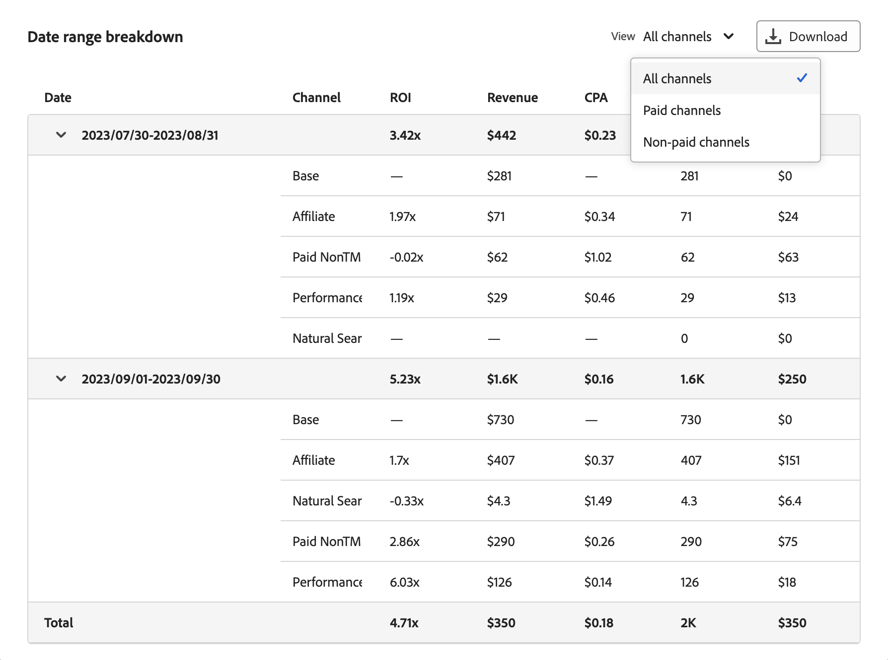

# Plan insights

  
In [!UICONTROL Plan insights], your plan insights are created, showing the [!UICONTROL Model], the [!UICONTROL Data range], and [!UICONTROL Total budget] on which the plan is based.

When finished retrieving, you see an overview of your plan, consisting of: 

- [!UICONTROL Forecasted paid channel ROI] visualization
- [!UICONTROL Forecasted revenue] visualization 
- [!UICONTROL Forecasted conversion] visualization
- [!UICONTROL Marginal channel return] visualization
- [!UICONTROL Data range breakdown] table of the plan, showing columns for

  - Channel
  - ROI
  - CPA
  - Revenue
  - Conversion goal
  - Spend

To close the interface, select **[!UICONTROL Close]**. 

To change how to view the ROI of your plan, select **[!UICONTROL X]** or **[!UICONTROL  %]** at **[!UICONTROL View ROI]**. 

## Forecasted paid channel spend and ROI

This visualization shows a scatterplot for the forcasted spend and return on investment on your paid channels, based on the model, date range and budget.

## Forecasted revenue

This bar chart visualization shows the forecasted revenue for your channels based on the model, date range and budget.

## Forecasted conversions

This bar chart visualization shows the forecasted conversions for your channels based on the model, date range and budget.

## Marginal channel return

This line chart visualization shows a marginal return curve for the selected channel with indicators for the **[!UICONTROL Marginal break-even]** and **[!UICONTROL Return point]**. This visualization helps you to understand how spend for a channel is from reaching a marginal break-even point and whether you have room to increase spend in a channel or should spend less on a channel to improve the channel spend efficiency.

To select a specific channel for the visualization, select a channel from the **[!UICONTROL View]** dropdown menu.

## Date range breakdown

The [!UICONTROL Date range breakdown] table shows detailed granular data per channel for [!UICONTROL ROI], [!UICONTROL Revenue], [!UICONTROL CPA], [!UICONTROL Conversions] and [!UICONTROL Spend].

1. To download a CSV file containing the data of the Date range breakdown, select  **[!UICONTROL Download CSV]**. From the context menu:

   - Select  **[!UICONTROL Detailed CSV]** for detailed data in CSV format. 
   - Select  **[!UICONTROL Summary CSV]** for summary data in CSV format. 

   Detailed data is granular data keyed by week. Summary data is data keyed by the model-provided date range.

1. To view the Date range breakdown by category of channels, select **[!UICONTROL All channels]**, **[!UICONTROL Paid channels]**, or **[!UICONTROL Non-paid channels]** from the **[!UICONTROL View]** selection.

## Edit plan

1. To edit your plan, select  **[!UICONTROL Edit plan]**:
    
    1. In the **[!UICONTROL Spend selection]** section, for each budget date range, use the  to open the channel distribution view for that data range.

    1. To modify the budgets for each channel, modify the values for **[!UICONTROL Min]** and **[!UICONTROL Max]** or use the sliders.

    1. To toggle between currency or percentage input, select **[!UICONTROL $]** or **[!UICONTROL %]** for **[!UICONTROL View spend by]**.

       

    1. To edit the details of your plan, select **[!UICONTROL Edit details]**:

       1. In the **[!UICONTROL Setup]** section, if applicable, modify the **[!UICONTROL Plan name]** and the **[!UICONTROL Description]**.

       1. In the **[!UICONTROL Budget]** section:

          1. Modify the **[!UICONTROL Date range]** for one or more of your plan's date ranges, either by typing dates or selecting a date range using .

          1. Modify the **[!UICONTROL Budget]** for one or more of your plan's date ranges.
     
          To add additional date ranges, each with their budget, select  **[!UICONTROL Add row]**.
     
          To delete a date range and associated budget, select .

          To define a maximum budget:

          1. Switch **[!UICONTROL Maximize budget]** on.
          1. Specify the amount of maximum budget. The amount should be equal or higher than the total amount of budgets specified for the date ranges.

       1. Select **[!UICONTROL Next]** to return to the **[!UICONTROL Spend]** section. Select **[!UICONTROL Cancel]** to return back to your plans overview.

          

    1. If you have defined advanced configurations for your plan, select **[!UICONTROL Next]**.

       

       - Your plan name , model, date range and total budget are summarized.

       - By default, Mix Modeler automatically calculates the average revenue per conversion using the latest historical seasonal data. In **[!UICONTROL Average Revenue per conversion]** you can define specific average revenue per conversion.

         1. For each date range in your budget:
            1. Select a date range from the **[!UICONTROL Date range]** dropdown menu.
            1. Enter an **[!UICONTROL Average revenue]** value.
      
         1. Select  Add custom average revenue per conversion unit to add a date range.
         1. Select  to remove a date range.

         >[!NOTE]
         >
         >If your model doesn't include historical revenue data, you must define an average revenue per conversion for each date range you specified for your budget.
         >

       - By default, Mix Modeler automatically calculates channel costs using the latest historical seasonal data. In **[!UICONTROL Channel costs]** you can define custom channel costs.

         1. For each channel in your model, define custom channel cost.
            1. Select a channel from the **[!UICONTROL Channel]** dropdown menu.
            1. For each date range in your budget:   
               1. Select a date range from the **[!UICONTROL Date range]** dropdown menu.
               1. Enter an **[!UICONTROL Average revenue]** value.
            1. Select  **[!UICONTROL Add custom average revenue per conversion unit]** to add a date range.
            1. Select  to remove a date range.

         1. Select  **[!UICONTROL Add custom channel cost]** to add a channel.
         1. Select  to remove a custom channel.

1. When finished editing your plan, select **[!UICONTROL Edit]**.

    In the **[!UICONTROL All changes are final]** dialog, select **[!UICONTROL OK]** to update the plan's current spend allocation and ROI and revenue forecasts. Select **[!UICONTROL Cancel]** to cancel the update of your plan.

1. To cancel your plan updates, select **[!UICONTROL Cancel]**.

    In the **[!UICONTROL No work will be saved]** dialog, select **[!UICONTROL Cancel]** to continue working on your plan or select **[!UICONTROL OK]** to return back to the Plans interface.
