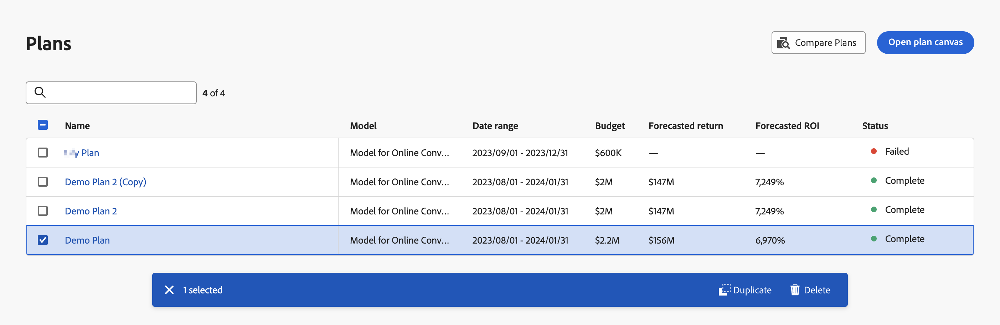

# Plans

Plans in Adobe Mix Modeler allow you to allocate budgets by business unit and channel. The planning functionality is integrated with the outcomes of the trained models based on your harmonized data.

## View plans

To view a table of your current plans, in the Adobe Mix Modeler interface:

1. Select  **[!UICONTROL Plans]** from the left rail.

1. You see a table of the current plans and their status.

    The table columns specify details about the plans.

    | Column name | Details |
    |---|---|
    | Name | Name of the plan |
    | Description | Description of the model |
    | Model | The model used as the base for the plan. |
    | Date range | The full date range for a plan. |
    | Budget | The total budget for a plan. |
    | Forecasted return | The forecasted return for a plan |
    | Forecasted ROI | The forecasted ROI for a plan. |
    | Status | The status of a plan. |

    {style="table-layout:auto"}

1. Use  to search and filter the table for one or more specific plans.

## Select and action on plans

You can select one or more plans, which reveals the Plans action bar. The action bar allows you to delete, compare, or duplicate plans. 

To remove all the selections in the Plans table, select  in the action bar

### Duplicate a plan

To duplicate a plan:

1. Select a single plan from the table.
1. Select  **[!UICONTROL Duplicate]** from the action bar. A new plan, with a name composed of the original plan's name appended with **[!UICONTROL (Copy)]**, is added to the top of the table. 

### Compare plans

To compare plans:

1. Select two plans from the table.
1. Select  **[!UICONTROL Compare]** from the action bar. You see the **[!UICONTROL Compare plans]** UI. 

### Delete plans

To delete plans:

1. Select one or more plans from the table.
1. Select  **[!UICONTROL Delete]** from the action bar. Your plan is deleted immediately.

