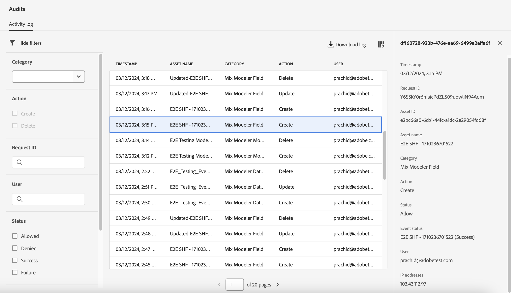

# Audit

>[!AVAILABILITY]
>
>The functionality described in this article is in the Limited Testing phase of release and might not be available yet in your environment. This note will be removed when the functionality is generally available. For information about the latest Mix Modeler releases, see [Mix Modeler releases](/help/releases/latest.md).

You can audit what users are doing in Mix Modeler, using the Audit interface part of the Experience Platform and embedded in the Mix Modeler UI.

To inspect the audit log, in the Mix Modeler interface:

1. Select  **[!UICONTROL Audits]** from **[!UICONTROL PRIVACY]**.

1. In **[!UICONTROL Audits]** you can find the **[!UICONTROL Activity log]**. The Activity log will show entries for the following Mix Modeler categories, actions and status. 

   | Category | Action | Status |
   |---|---|---|
   | Mix Modeler Dataset Rule | Create | Allow or Denied |
   | Mix Modeler Dataset Rule | Update | Allow or Denied |
   | Mix Modeler Dataset Rule | Delete | Allow or Denied |
   | Mix Modeler Field | Create | Allow or Denied |
   | Mix Modeler Field | Update | Allow or Denied |
   | Mix Modeler Field | Delete | Allow or Denied |
   | Mix Modeler Marketing Touchpoint | Create | Allow or Denied |
   | Mix Modeler Marketing Touchpoint | Update | Allow or Denied |
   | Mix Modeler Marketing Touchpoint | Delete | Allow or Denied |
   | Mix Modeler Conversion | Create | Allow or Denied |
   | Mix Modeler Conversion | Update | Allow or Denied |
   | Mix Modeler Conversion | Delete | Allow or Denied |
   | Mix Modeler Model | Create | Allow or Denied |
   | Mix Modeler Model | Update | Allow or Denied |
   | Mix Modeler Model | Delete | Allow or Denied |

1. Select an entry in the Activity log to open a panel for more details.

   

1. To filter on **[!UICONTROL Category]**, **[!UICONTROL Action]**, **[!UICONTROL Request ID]**, **[!UICONTROL User]**, **[!UICONTROL Status]** or **[!UICONTROL Date]** range, select .

1. To modify the columns displayed in the Activity log, select  and in the **[!UICONTROL Customize table]** dialog select the columns to show. Select **[!UICONTROL Apply]** to apply the selection, **[!UICONTROL Cancel]** to cancel the selection.

1. To download the audit log, select  **[!UICONTROL Download log]**. In the **[!UICONTROL Download log]** dialog select either **[!UICONTROL CSV]** or **[!UICONTROL JSON]** as the format and select **[!UICONTROL Download]**.

